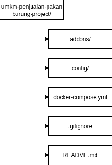

# Proyek Implementasi Website Operasional UMKM Penjualan Pakan Burung

Proyek ini merupakan implementasi sistem ERP berbasis Odoo versi terbaru (v18) untuk mendukung operasional UMKM di bidang penjualan pakan burung. Sistem ini dikemas menggunakan Docker agar mudah dijalankan, dikembangkan, dan dikelola secara fleksibel.

---

## Struktur Proyek



---

## Cara Menjalankan

1. Pastikan Docker dan Docker Compose sudah terpasang di server atau komputer Anda.
2. Pastikan file password PostgreSQL ada di `config/odoo_pg_pass` dengan isi password (contoh: `odoo123`).

3. Jalankan perintah berikut di folder proyek:

```bash
docker-compose up -d
```

## Referensi

- **Dokumentasi Odoo 18**  
  [https://www.odoo.com/documentation/18.0/](https://www.odoo.com/documentation/18.0/)  
  Dokumentasi resmi Odoo versi 18 untuk pengembangan dan konfigurasi.

- **Docker Hub - Odoo**  
  [https://hub.docker.com/_/odoo](https://hub.docker.com/_/odoo)  
  Informasi resmi image Docker Odoo yang digunakan dalam proyek.

- **Docker Hub - PostgreSQL**  
  [https://hub.docker.com/_/postgres](https://hub.docker.com/_/postgres)  
  Image resmi PostgreSQL untuk kebutuhan database pada proyek.

---

## Author

[@arifnoerramadhan](https://www.instagram.com/arifnoerramadhan/)
